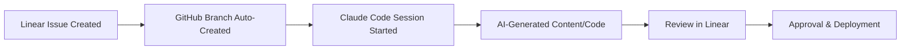

# Claude Code Integration Workflow

## Overview
This document outlines how team members will use Claude Code integrated with Linear to maximize productivity and ensure consistent execution of GTM tasks.

---

## Core Integration Flow

### 1. Task Creation → Code Generation Pipeline


### 2. Repository Structure
```
consuelo_web_gtm/
├── content/
│   ├── blog-posts/
│   ├── video-scripts/
│   ├── social-media/
│   └── email-campaigns/
├── outbound/
│   ├── email-templates/
│   ├── linkedin-sequences/
│   └── call-scripts/
├── partnerships/
│   ├── reseller-materials/
│   ├── integration-docs/
│   └── proposals/
└── automation/
    ├── linear-webhooks/
    ├── content-generators/
    └── data-pipelines/
```

---

## Team-Specific Workflows

### Ryan (SEO & Business Development)

#### Content Creation Workflow
1. **Linear Issue**: "Create blog post about insurance agent turnover"
2. **Claude Code Usage**:
   ```bash
   claude code start
   # AI generates:
   # - SEO-optimized outline
   # - 2000-word blog post
   # - Meta descriptions
   # - Social media snippets
   # - Email newsletter section
   ```
3. **Review Process**: Ryan edits for brand voice, adds personal insights
4. **Approval**: Kokayi reviews in Linear, approves for publishing

#### SEO Research Workflow
1. **Linear Issue**: "Research keywords for Q1 content calendar"
2. **Claude Code Usage**:
   ```bash
   claude code analyze-keywords
   # AI generates:
   # - Keyword difficulty analysis
   # - Content gap opportunities
   # - Competitor content audit
   # - Content calendar with titles
   ```
3. **Output**: Structured data in Linear for team planning

### Juan (Partnership & Outreach)

#### Outbound Campaign Creation
1. **Linear Issue**: "Create LinkedIn sequence for insurance agency owners"
2. **Claude Code Usage**:
   ```bash
   claude code generate-outreach
   # AI creates:
   # - 5-message LinkedIn sequence
   # - Personalization variables
   # - Follow-up email templates
   # - Call script alternatives
   ```
3. **Personalization**: Juan adds specific industry insights, recent news
4. **Testing**: A/B test different versions through Linear tracking

#### Partnership Proposal Generation
1. **Linear Issue**: "Create partnership proposal for [Company Name]"
2. **Claude Code Usage**:
   ```bash
   claude code create-proposal
   # AI generates:
   # - Company research summary
   # - Customized value proposition
   # - Partnership structure options
   # - Implementation timeline
   # - ROI projections
   ```
3. **Review**: Kokayi adds strategic input, approves terms

### Kokayi (CEO - Strategy & Closing)

#### Strategic Document Creation
1. **Linear Issue**: "Create board deck for Q1 metrics"
2. **Claude Code Usage**:
   ```bash
   claude code generate-deck
   # AI creates:
   # - Executive summary slides
   # - Metric visualizations
   # - Market analysis
   # - Financial projections
   ```
3. **Enhancement**: Kokayi adds strategic insights, future vision

#### Sales Enablement Materials
1. **Linear Issue**: "Update demo script for financial services"
2. **Claude Code Usage**:
   ```bash
   claude code create-demo-script
   # AI generates:
   # - Industry-specific talking points
   # - Objection handling responses
   # - ROI calculation examples
   # - Closing techniques
   ```

---

## Automated Linear Integration

### Webhook-Triggered Automation
```javascript
// Linear webhook listener
app.post('/linear-webhook', (req, res) => {
  const { type, data } = req.body;

  if (type === 'Issue' && data.action === 'create') {
    // Auto-create GitHub branch
    createGitHubBranch(data.issue.identifier);

    // Generate initial Claude Code prompt
    generateClaudePrompt(data.issue.title, data.issue.description);

    // Create content brief
    if (data.issue.labels.includes('content')) {
      generateContentBrief(data.issue);
    }
  }
});
```

### Content Brief Auto-Generation
When a content-labeled issue is created, Claude Code automatically generates:
- Target audience analysis
- SEO keyword suggestions
- Content outline
- Distribution channel recommendations
- Success metrics to track

### Prospect Research Automation
When an outbound-labeled issue is created for a specific company:
- Company background research
- Recent news and triggers
- Key decision makers
- Personalization opportunities
- Recommended outreach approach

---

## Quality Control Process

### Review Checkpoints
1. **AI Generation**: Claude Code creates initial draft
2. **Expert Review**: Subject matter expert (Ryan/Juan) reviews and enhances
3. **Strategic Approval**: Kokayi approves major content/campaigns
4. **Performance Tracking**: Linear tracks success metrics post-launch

### Brand Voice Consistency
- Claude Code trained on existing brand content
- Style guide integrated into AI prompts
- Ryan maintains brand voice standards
- Regular AI output quality reviews

### Compliance & Legal
- All outbound sequences reviewed for CAN-SPAM compliance
- Partnership agreements reviewed by legal before sending
- Insurance industry regulations considered in content

---

## Linear API Integration Scripts

### Task Creation Automation
```javascript
// Auto-create weekly content tasks
const createWeeklyTasks = async () => {
  const contentCalendar = await generateContentCalendar();

  for (const content of contentCalendar) {
    await linearClient.createIssue({
      teamId: GROWTH_TEAM_ID,
      title: content.title,
      description: content.brief,
      labels: ['content', 'P2'],
      assigneeId: RYAN_USER_ID
    });
  }
};
```

### Progress Reporting
```javascript
// Weekly GTM progress report
const generateGTMReport = async () => {
  const issues = await linearClient.issues({
    filter: { team: { id: { eq: GROWTH_TEAM_ID } } }
  });

  const report = {
    completed: issues.filter(i => i.state.name === 'Done').length,
    inProgress: issues.filter(i => i.state.name === 'In Progress').length,
    blockers: issues.filter(i => i.labels.includes('blocked')).length
  };

  // Send to Slack/email
  sendProgressReport(report);
};
```

---

## Success Metrics

### Productivity Metrics
- Time from task creation to completion: Target <48 hours
- Content creation velocity: Target 3 pieces per week
- Outreach sequence creation: Target 1 sequence per day
- Partnership proposal turnaround: Target 24 hours

### Quality Metrics
- Content engagement rates: Monitor social, blog metrics
- Outbound response rates: Track email, LinkedIn performance
- Partnership conversion rates: Measure proposal-to-agreement
- Claude Code accuracy: % of AI content used without major edits

### Team Adoption
- % of tasks using Claude Code integration: Target 80%
- Time saved per task: Target 60% reduction
- Team satisfaction with AI assistance: Target 4.5/5 rating